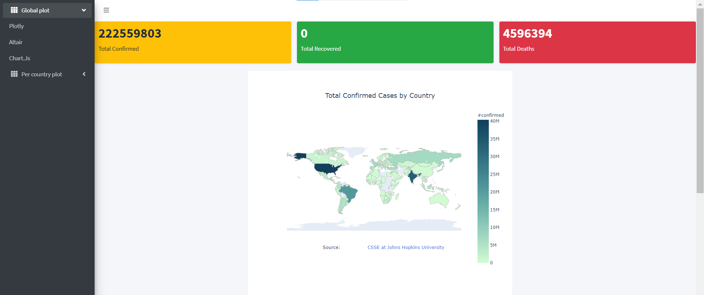
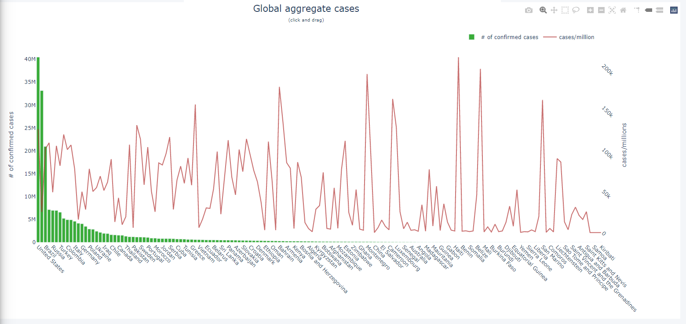

# CovidDashboardApp

Covid Dashboard App displaying covid 19 statistics from all around the world. Built using Flask and chart.js.

## Images

World Wide Statistics for Covid disease

Global aggregate cases
